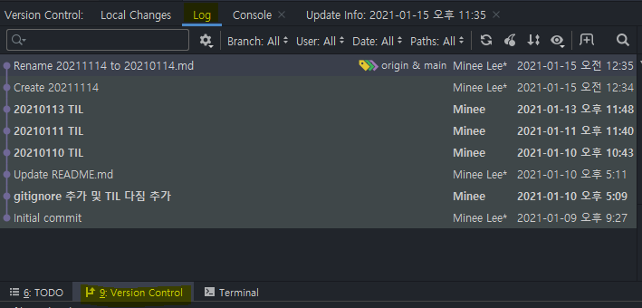
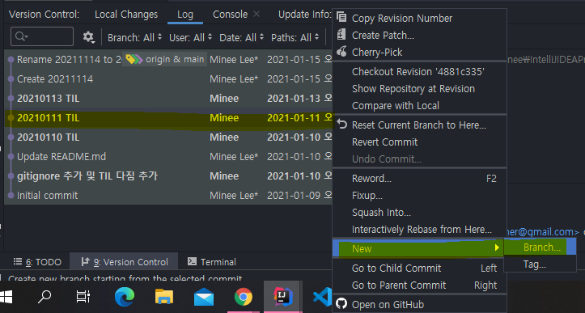
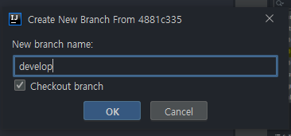
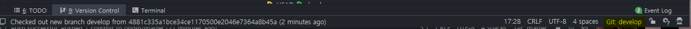

# 2020.01.15 (Fri)
### Today I Done
- [x] 백준 알고리즘 문자열 2문제
***
### Today I Learned
> 내가 외운 아스키코드  
   - A = 65  
   - a = 97
> IntelliJ에서 이전 버전(이전에 commit push한 곳)으로 새로운 branch를 만드는 법
  1. Version Control -> Log  
  
  2. 되돌아가고 싶은 commitLog에서 마우스 우클릭 -> New -> Branch  
  
  3. branch 이름 정하고 OK  
  
  4. intelliJ 우측 하단에 새로 생성한 브랜치 확인  
  
  
